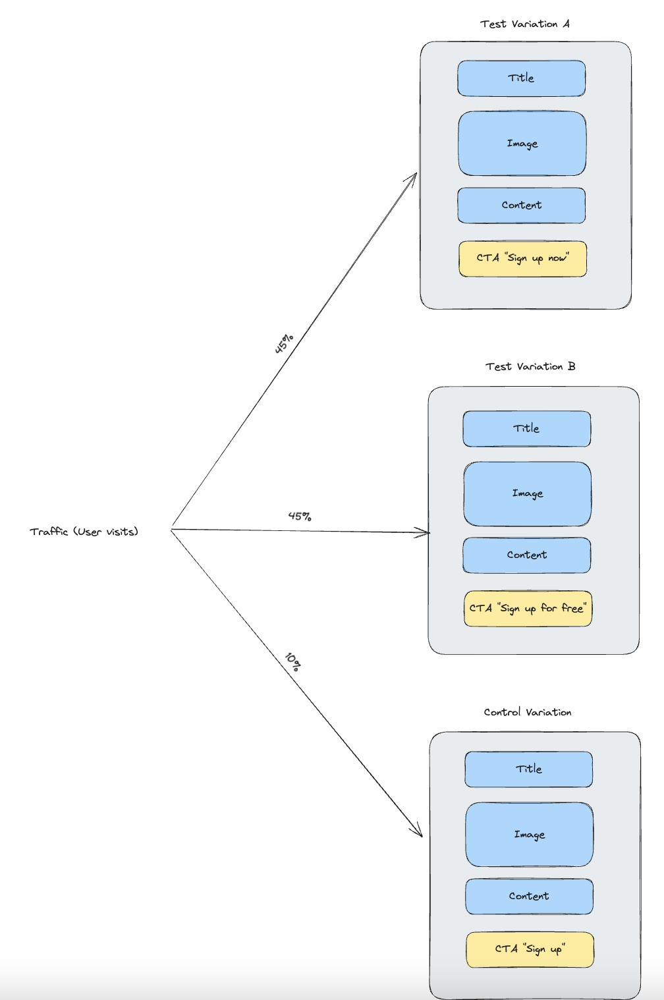

This is a [Next.js](https://nextjs.org/) project bootstrapped with [`create-next-app`](https://github.com/vercel/next.js/tree/canary/packages/create-next-app).

## Getting Started

First, run the development server:

```bash
npm run dev
# or
yarn dev
```

Open [http://localhost:3000](http://localhost:3000) with your browser to see the result.

You can start editing the page by modifying `pages/index.js`. The page auto-updates as you edit the file.

[API routes](https://nextjs.org/docs/api-routes/introduction) can be accessed on [http://localhost:3000/api/hello](http://localhost:3000/api/hello). This endpoint can be edited in `pages/api/hello.js`.

The `pages/api` directory is mapped to `/api/*`. Files in this directory are treated as [API routes](https://nextjs.org/docs/api-routes/introduction) instead of React pages.

## Goal 

- Increase amount of sign ups
- - Track CTR (Clikc through rate) of each variation to roll out the best performing one.
- - Employ AB-testing to learn which content formats work and which don’t.
- - Empower content editors to launch AB tests without engineering support.

## Acceptance criterias 

- Visitor sees only one variation (assigned randomly) when they land on the page.
- The assigned variation doesn’t change after the page reloads.
- Track a pageview via the analytics-api.js method when a visitor lands on the page.
- Track an event via the analytics-api.js method when a visitor clicks on the “Sign up” button.
- Every single page view X and click shall be tracked.
- We want to determine a winning variation by comparing the CTR (click-through rate) of clicks on the “Sign up” button. The CTR of a page is "number of clicks" divided by "number of page views". As a user can only effectively convert aka signup once, the counts for the CTR computation need to be unique per user. So a single user clicking ten times and reloading the page 5 times should still be only counted as one converted user. Make sure this is possible with the data you send and explain on a high level how.

## Assumptions

- We use a marketing tool to split the traffic to each variation (A, B, Control)
- We track only the click on the button (not random clicks in the rest of the page)
- We use cookies to store the displayed variation and user signed up state. In a real case scenario, the user state can be pulled from the server (user db)
- The A/B test applies to the content of the CTA. This could be expanded to other contents and page designs
- We assume the sign up is successfull after clicking
- The tracking is done through a helper, in a real case scenario we would have an API to a marketing tool
- The content can be edited in the data/blodData.json, we could implement a CMS (e.g. Sanity) to make easier for non tech members to edit and run test on their own.


## AB Test diagram
A marketing tool redirect the visits (traffic) to three different versions of a page during a set amount of time.
This enables us to analyse which version is performing better and to roll this one out. 

e.g. In this case we would roll out Variation B
- Variation A - 45% of traffic, CTR 4%
- Variation B - 45% of traffic, CTR 5%
- default - 10% of traffic, CTR 4%


 

## Demo 
[Demo](https://www.loom.com/share/fee6c5553dee466c9dfda662295ee499?sid=682f47f8-74ce-4f45-9138-1d5785fbf78c)

## Learn More

To learn more about Next.js, take a look at the following resources:

- [Next.js Documentation](https://nextjs.org/docs) - learn about Next.js features and API.
- [Learn Next.js](https://nextjs.org/learn) - an interactive Next.js tutorial.

You can check out [the Next.js GitHub repository](https://github.com/vercel/next.js/) - your feedback and contributions are welcome!

## Deploy on Vercel

The easiest way to deploy your Next.js app is to use the [Vercel Platform](https://vercel.com/new?utm_medium=default-template&filter=next.js&utm_source=create-next-app&utm_campaign=create-next-app-readme) from the creators of Next.js.

Check out our [Next.js deployment documentation](https://nextjs.org/docs/deployment) for more details.
